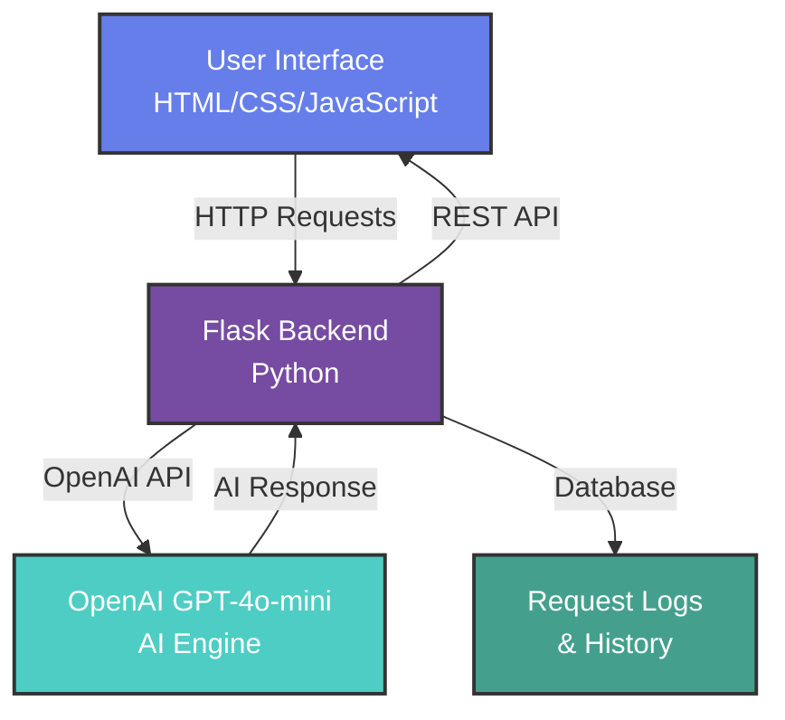
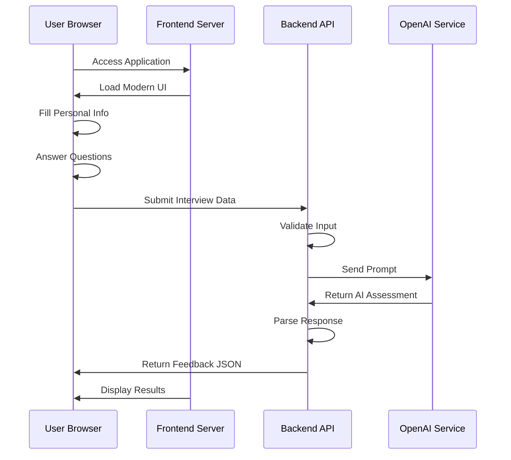
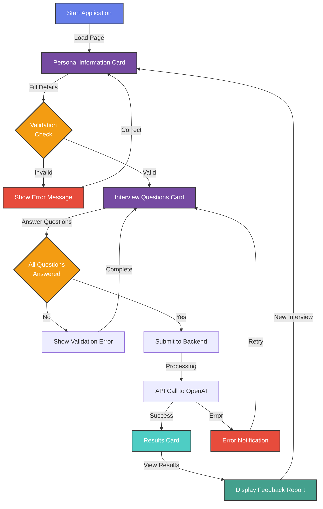
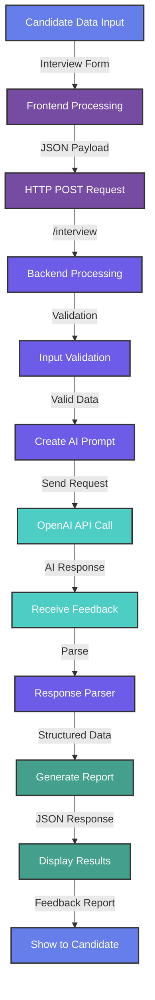
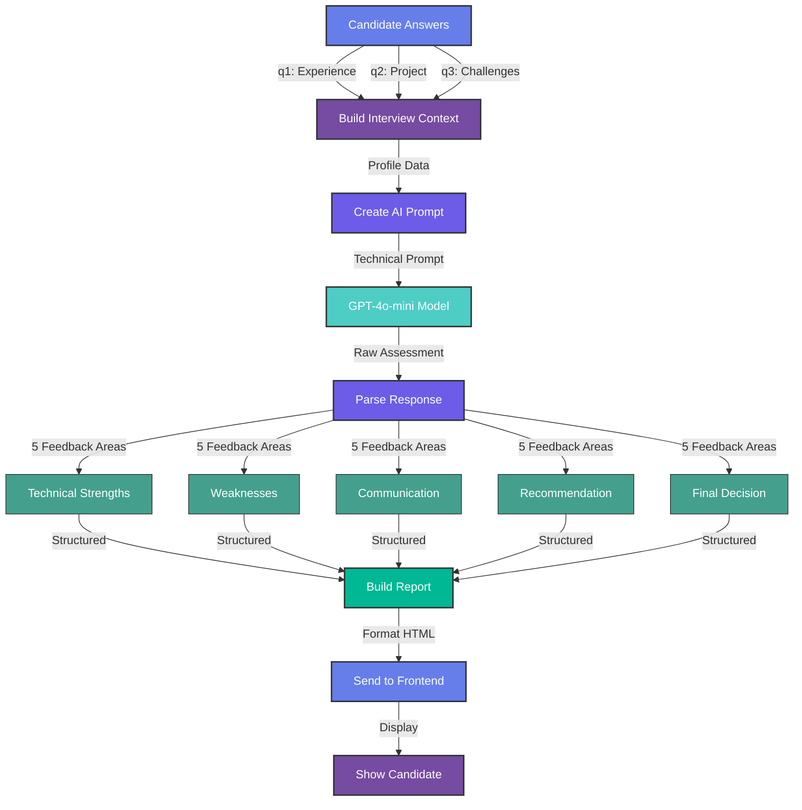

# AI Interviewer

A modern, professional AI-powered interview assessment tool built with Flask, OpenAI GPT, and a responsive web interface.

## Features

- **AI-Powered Assessment**: Uses OpenAI GPT-4o-mini for intelligent candidate evaluation
- **Modern UI**: Beautiful, responsive web interface with card-based design
- **Professional Backend**: Production-ready Flask API with comprehensive error handling
- **Real-time Feedback**: Instant AI-generated interview feedback
- **Secure**: Proper input validation and error handling

## Tech Stack

- **Backend**: Python Flask with OpenAI integration
- **Frontend**: HTML5, CSS3, JavaScript (Vanilla)
- **AI**: OpenAI GPT-4o-mini
- **Styling**: Modern CSS with gradients and animations
- **Icons**: Font Awesome

## Architecture Overview



## Application Flow



## User Journey



## System Architecture

```mermaid
graph LR
    subgraph Client["Client Layer"]
        HTML["HTML Structure"]
        CSS["CSS Styling"]
        JS["JavaScript Logic"]
    end
    
    subgraph Server["Server Layer"]
        Flask["Flask Framework"]
        Validation["Input Validation"]
        ErrorHandler["Error Handling"]
    end
    
    subgraph AI["AI Processing"]
        Prompt["Prompt Engineering"]
        OpenAI["OpenAI API"]
        Parser["Response Parser"]
    end
    
    Client -->|HTTP| Server
    Server -->|Requests| AI
    AI -->|Results| Server
    Server -->|JSON Response| Client
    
    style Client fill:#667eea,stroke:#333,stroke-width:2px,color:#fff
    style Server fill:#764ba2,stroke:#333,stroke-width:2px,color:#fff
    style AI fill:#4ecdc4,stroke:#333,stroke-width:2px,color:#fff
    style HTML fill:#5e72e4,stroke:#333,stroke-width:1px,color:#fff
    style CSS fill:#5e72e4,stroke:#333,stroke-width:1px,color:#fff
    style JS fill:#5e72e4,stroke:#333,stroke-width:1px,color:#fff
    style Flask fill:#6c5ce7,stroke:#333,stroke-width:1px,color:#fff
    style Validation fill:#6c5ce7,stroke:#333,stroke-width:1px,color:#fff
    style ErrorHandler fill:#6c5ce7,stroke:#333,stroke-width:1px,color:#fff
    style Prompt fill:#00b894,stroke:#333,stroke-width:1px,color:#fff
    style OpenAI fill:#00b894,stroke:#333,stroke-width:1px,color:#fff
    style Parser fill:#00b894,stroke:#333,stroke-width:1px,color:#fff
```



## Prerequisites

- Python 3.8+
- OpenAI API Key
- Modern web browser

## Installation

1. **Clone the repository** (if applicable) or navigate to the project directory

2. **Install Python dependencies**:
   ```bash
   pip install flask openai flask-cors
   ```

3. **Get OpenAI API Key**:
   - Visit https://platform.openai.com/account/api-keys
   - Create a new secret key
   - Copy the key (starts with `sk-proj-`)

4. **Configure API Key**:
   - Open `backend/ai_interview.py`
   - Replace `'your-api-key-here'` with your actual OpenAI API key:
   ```python
   OPENAI_API_KEY = os.getenv('OPENAI_API_KEY', 'sk-proj-your-actual-key-here')
   ```

## Running the Application

### Start Backend Server:
```bash
cd backend
python ai_interview.py
```
The backend will run on `http://127.0.0.1:5000`

### Start Frontend Server:
```bash
cd frontend
python -m http.server 8000
```
The frontend will run on `http://localhost:8000`

### Access the Application:
Open your browser and go to `http://localhost:8000`

## Usage

1. **Fill Personal Information**:
   - Enter your name, qualification, skills
   - Select the job role you're applying for

2. **Answer Interview Questions**:
   - Describe your relevant experience
   - Detail your biggest project
   - Explain how you handle challenges

3. **Get AI Feedback**:
   - Click "Finish Interview"
   - Receive comprehensive AI-powered assessment
   - View technical strengths, weaknesses, communication skills, recommendations, and final decision

## Project Structure

```
ai-interviewer-mini/
├── backend/
│   ├── ai_interview.py      # Flask API server
│   └── .env                 # Environment variables
├── frontend/
│   ├── index.html           # Main HTML page
│   ├── style.css            # Modern CSS styling
│   └── script.js            # Frontend JavaScript
└── README.md                # Documentation
```

## Data Flow Diagram



## API Endpoints

### POST `/interview`
Processes interview data and returns AI feedback.

**Request Body:**
```json
{
  "name": "John Doe",
  "qualification": "Bachelor's in Computer Science",
  "skills": "Python, JavaScript, SQL",
  "jobRole": "Python Developer",
  "answers": {
    "q1": "I have 3 years of experience...",
    "q2": "My biggest project was...",
    "q3": "When facing challenges, I..."
  }
}
```

**Response:**
```json
{
  "technical_strengths": "Strong Python expertise...",
  "weaknesses": "Limited experience in...",
  "communication": "Clear and professional...",
  "recommendation": "Consider for junior role...",
  "decision": "HIRE"
}
```

### GET `/health`
Health check endpoint for monitoring.

## Feedback Generation Pipeline



## Security Features

- Input validation and sanitization
- CORS enabled for frontend communication
- Error handling without exposing sensitive information
- Secure API key management

## Error Handling

The application includes comprehensive error handling:

- **Invalid API Key**: Returns user-friendly error message
- **Network Issues**: Graceful fallback with retry logic
- **Invalid Input**: Detailed validation with specific error messages
- **Server Errors**: Proper logging and 500 error responses

## UI Features

- **Responsive Design**: Works on desktop, tablet, and mobile
- **Modern Aesthetics**: Gradient backgrounds, shadows, and animations
- **Card-Based Layout**: Clean, professional interface
- **Loading States**: Visual feedback during processing
- **Error Notifications**: User-friendly error messages

## Development

### Adding New Features:
1. Backend changes in `ai_interview.py`
2. Frontend changes in respective HTML/CSS/JS files
3. Test both servers together

### Environment Variables:
```bash
export OPENAI_API_KEY="your-key-here"
export FLASK_DEBUG="True"
export PORT="5000"
```

## Contributing

1. Fork the repository
2. Create a feature branch
3. Make your changes
4. Test thoroughly
5. Submit a pull request

## License

This project is open source. Feel free to use and modify as needed.

---
## Special Thanks To
- OpenAI for their powerful language models.
- The Flask community for their excellent web framework.
- **Developed by:** @Tanishq-JM
